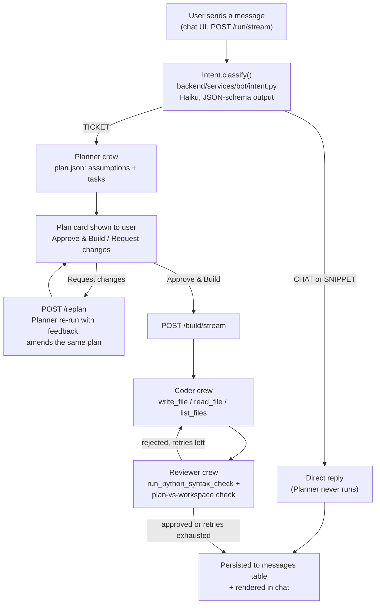

# Amper Bot — Ticket-to-Code Agent Pipeline

Amper is a chat assistant built on [CrewAI](https://github.com/crewAIInc/crewAI),
[FastAPI](https://fastapi.tiangolo.com/), and Anthropic's Claude models. It sits in front of a
three-agent pipeline — **Planner**, **Coder**, **Reviewer** — that turns a short, natural-language
feature ticket into an ordered technical plan, an implementation of that plan, and a pass/fail
review that can send the work back for another attempt. Not every message is a ticket, though:
a lightweight classifier sits in front of the pipeline so a quick question ("what can you do?")
or a self-contained code request ("give me a FastAPI hello-world script") gets answered directly
instead of being forced into a fake implementation plan.

## Table of contents

1. [Overview](#overview)
2. [Architecture](#architecture)
3. [Project structure](#project-structure)
4. [Prerequisites](#prerequisites)
5. [Installation](#installation)
6. [Usage](#usage)
7. [HTTP API reference](#http-api-reference)
8. [Agent trace](#agent-trace)
9. [Configuration](#configuration)
10. [Known limitations](#known-limitations)
11. [Legacy / unused code](#legacy--unused-code)
12. [How to extend it](#how-to-extend-it)

---

## Overview

A message sent from the chat UI goes through two layers before anything gets built:

1. **Intent routing.** A cheap, fast classification call (Claude Haiku) decides whether the
   message is a `TICKET` (a real request to build/change something in *this* product's own
   codebase), a `SNIPPET` (a self-contained technical ask that doesn't touch this product —
   "write me a regex for emails"), or `CHAT` (small talk, questions about the assistant itself).
   `SNIPPET` and `CHAT` are answered directly and never reach the Planner. Only `TICKET` proceeds
   to step 2.
2. **The ticket pipeline.** A **Planner** agent breaks the ticket into an explicit, ordered task
   list with any assumptions it had to make. That plan is shown to the user as an editable card —
   nothing is built yet. The user can approve it, edit tasks inline first, or send feedback for
   the Planner to revise. Once approved, a **Coder** agent implements every task using real
   file-system tools, and a **Reviewer** agent checks the result against the plan (running a
   Python syntax check first). A rejection sends the Coder back with the Reviewer's specific
   feedback, up to a configurable retry limit.

Both layers stream real progress to the UI over Server-Sent Events instead of a static "loading"
spinner — status updates while the intent check / Planner run, and live file-by-file output while
the Coder writes code.

Conversations persist to a SQLite database and are replayable from the sidebar: plans replay as
the same rich, read-only card the user originally saw (not flattened text), and cross-turn
context (so a follow-up like "how do I use that in a real scenario" understands what was just
discussed) is read from that same database rather than from any in-memory buffer.

## Architecture



### The intent gate

`Intent` (`backend/services/bot/intent.py`) is a single Haiku call constrained to strict JSON
output (`{"intent": "TICKET"|"SNIPPET"|"CHAT", "reply": "..."}`). `reply` carries the actual
answer for `SNIPPET`/`CHAT` — the same call both classifies and (when appropriate) writes the
response, so there's no separate round trip for chit-chat. It fails safe toward `TICKET` on any
error, since silently dropping a real request is worse than the Planner making an assumption
about a message it didn't need to see.

### The ticket pipeline

1. **Entry point.** `start_plan()` (`backend/services/research.py`) runs the intent check, and
   for `TICKET` calls `plan_ticket()` (`agents/ticket_pipeline/main.py`), which loads any prior
   turns for the conversation and kicks off `TicketPlanFlow` (`agents/ticket_pipeline/flow.py`).
2. **Workspace.** Each conversation gets its own directory, `workspaces/<conversation_id>/`,
   registered as the *active workspace* via a `ContextVar`
   (`agents/ticket_pipeline/tools.py::set_active_workspace`) so every file tool call that turn is
   scoped to it, with a path-traversal guard.
3. **Planner.** A one-agent, one-task crew runs `build_plan_task()`. The Planner is instructed to
   make its own reasonable assumptions instead of asking for clarification, and — when revising —
   to amend the existing plan rather than start over. Output is parsed as strict JSON
   (`{"assumptions": [...], "tasks": [{"id", "description"}, ...]}`).
4. **Approval loop.** The plan is shown to the user, not built immediately. `POST /replan`
   re-runs the Planner with the user's feedback against the same pending plan
   (`backend/cache/plan_cache.py`). `POST /build` / `/build/stream` is what actually kicks off
   the Coder → Reviewer loop, once approved.
5. **Coder ⇄ Reviewer retry loop** (`TicketBuildFlow.run()`): `_code()` implements the plan (with
   the Reviewer's prior feedback prepended to the task description on any retry); `_review()`
   runs the syntax checker first, then checks the workspace against every task, returning
   `{"approved": bool, "feedback": str}`. Approval breaks the loop; otherwise it retries up to
   `max_retries` (default `3`, so up to 4 total Coder attempts) and returns the last attempt
   regardless of outcome — it never blocks indefinitely.
6. **Persistence.** Every turn — chat reply, snippet, plan, or build result — is written via
   `backend/services/chat.py::record_message` / `end_conversation` into the SQLite `messages`
   table. Plan turns are stored as a structured payload (`{"type": "plan", "plan": {...},
   "ticket": "..."}`), not flattened markdown, so reopening a saved conversation rebuilds the
   same rich card instead of a wall of plain text.

### Streaming

- `/run/stream` streams `"phase"` status events ("Reading your message…", "Planning the
  work…", "Wrapping up…") from an `asyncio.Queue`, since `start_plan()` is plain async work with
  no thread boundary to cross.
- `/build/stream` streams the same kind of phase events *plus* `"file"` events (a file's full
  content the moment the Coder writes it) from a background thread running the CrewAI flow — see
  `agents/ticket_pipeline/events.py` for how CrewAI's own tool-usage events get bridged across
  that thread boundary via a `ContextVar`-scoped queue.
- Reply text itself (the plan's content, a SNIPPET's code, a CHAT answer) is **not**
  token-streamed — it's generated as one constrained JSON call for reliability, then revealed in
  the UI with a capped-duration client-side animation (`appendMessageTyped()` in
  `static/js/app.js`) rather than shown all at once. This is a cosmetic reveal of an
  already-complete response, not real generation progress.

### Cross-turn memory

`backend/cache/conversation_cache.py` is a per-turn staging buffer only — `end_conversation()`
flushes it to a new database row and clears it after every turn. Anything that needs to know
"what's been said so far" (the intent classifier, the summary/title generator) reads from
`backend/services/chat.py::get_conversation_history()` instead, which queries the database
directly and concatenates every persisted row for that conversation in chronological order. This
is what lets a follow-up message be answered with real awareness of the prior exchange, and
survives the per-turn cache clear.

`backend/cache/ticket_cache.py` and `backend/cache/plan_cache.py` are separate, still purely
in-memory stores: the former holds completed build turns (so the Planner can treat a follow-up
ticket as an amendment), the latter holds a plan awaiting approval so `/build`/`/replan` can pick
it back up. Neither survives a process restart — see [Known limitations](#known-limitations).

## Project structure

```text
amper_bot/
├── agents/
│   ├── common/
│   │   └── llm.py                  # Shared Claude (Anthropic) client for Planner/Coder/Reviewer
│   ├── ticket_pipeline/
│   │   ├── agent.py                 # Planner / Coder / Reviewer Agent definitions
│   │   ├── tools.py                 # Workspace-scoped file tools + syntax checker
│   │   ├── tasks.py                 # Task factories (plan/code/review), rebuilt each retry
│   │   ├── flow.py                  # TicketState + TicketPlanFlow / TicketBuildFlow / TicketFlow
│   │   ├── events.py                # Bridges CrewAI's event bus to /build/stream's SSE queue
│   │   └── main.py                  # plan_ticket() / build_ticket() / run_ticket_pipeline()
│   └── research/                    # Unused legacy module -- see Legacy / unused code
├── backend/
│   ├── app.py                       # FastAPI app: mounts /static, includes the router, runs init_db() on startup
│   ├── main.py                      # get_db() dependency + init_db()
│   ├── db.py                        # SQLAlchemy engine/session/Base, sqlite:///./backend.db
│   ├── models.py                    # Users, Messages, AgentTraces ORM models (creates their tables)
│   ├── api/
│   │   └── routes.py                # HTTP surface -- see HTTP API reference
│   ├── cache/
│   │   ├── conversation_cache.py    # Per-turn staging buffer, cleared after every flush
│   │   ├── plan_cache.py            # Pending (unapproved) plan, keyed by conversation_id
│   │   └── ticket_cache.py          # Completed build turns, for Planner amendment context
│   ├── services/
│   │   ├── chat.py                  # Message persistence + cross-turn/full history reads
│   │   ├── research.py              # Intent gate + Planner/Coder orchestration called by routes.py
│   │   └── bot/
│   │       ├── intent.py            # Intent: TICKET / SNIPPET / CHAT classifier + direct reply
│   │       ├── summary.py           # Summary: short conversation title for the sidebar
│   │       └── model.py             # Unused legacy Vertex AI wrapper -- see Legacy / unused code
│   └── tests/                       # Empty -- no automated tests currently
├── static/
│   ├── index.html                   # Chat UI shell + confirm-delete modal markup
│   ├── css/app.css                  # UI styling (incl. plan cards, modal, light/dark theme)
│   ├── js/app.js                    # All UI state/behavior (sending, streaming, plan cards, replay)
│   └── js/api.js                    # Unused legacy fetch() wrapper module -- see Legacy / unused code
├── workspaces/                      # Generated per-conversation; where the Coder actually writes files
├── requirements.txt                 # Full dependency list (includes unused legacy deps -- see below)
└── .gitignore                       # Excludes bot_env/, __pycache__/, .env, credential JSON files
```

## Prerequisites

- **Python 3.12**
- **An Anthropic API key** with access to the models below — this is the only LLM provider the
  live code path uses. Set `ANTHROPIC_API_KEY` in a `.env` file at the repo root (loaded via
  `python-dotenv` in `agents/common/llm.py`, `backend/services/bot/intent.py`, and
  `backend/services/bot/summary.py`).
- Dependencies from `requirements.txt` (see [Installation](#installation)).

## Installation

```bash
# 1. Clone
git clone <repo-url> amper_bot
cd amper_bot

# 2. Create and activate a virtual environment
python -m venv bot_env
# Windows
bot_env\Scripts\activate
# macOS/Linux
source bot_env/bin/activate

# 3. Install dependencies
pip install -r requirements.txt
```

Create a `.env` file at the repo root:

```dotenv
ANTHROPIC_API_KEY=sk-ant-...
```

No manual database setup is needed — `backend/app.py`'s startup hook calls
`backend/main.py::init_db()`, which creates the `users` and `messages` tables (from
`backend/models.py`) in `backend.db` automatically if they don't already exist.

## Usage

```bash
uvicorn backend.app:app --reload
```

This serves the chat UI at `http://localhost:8000/` and the FastAPI docs (Swagger UI) at
`http://localhost:8000/docs`. Opening the page always starts on a fresh, empty conversation —
past conversations are listed in the sidebar and only load when clicked.

Type a message and send it:

- **A quick question or standalone code request** ("what can you do?", "give me a simple FastAPI
  script") gets a direct reply in the chat, with a live status label while it's generated. No
  plan, no files written.
- **A real feature/fix request** ("add a dark mode toggle to the settings page") gets a plan
  card: assumptions, an ordered task list (each task is editable inline), and two actions —
  **Request changes** (send feedback, the Planner revises the same plan) or **Approve & Build**
  (kicks off the Coder → Reviewer loop, streaming each file as it's written and the final
  approved/rejected result).

Reopening a past conversation from the sidebar replays it exactly as it looked live — including
rebuilding the same plan card (read-only, no action buttons, since there's no live
`plan_cache`/build state to resume once a conversation's been reloaded from history).

Restarting the server does **not** need to be a black box: `--reload` watches Python source files
and restarts a worker automatically, but it does *not* pick up changes to `.env` — if you rotate
`ANTHROPIC_API_KEY`, restart the server process yourself rather than relying on `--reload` to
notice.

## HTTP API reference

| Endpoint | Method | Purpose |
| --- | --- | --- |
| `/run` | POST | Non-streaming: intent-check, then either a direct reply or a Planner run. Returns `{conversation_id, plan, reply, error}`. |
| `/run/stream` | POST | Streaming counterpart of `/run` — what the chat UI actually uses. SSE `"phase"` events, then a final `"result"`/`"error"` event. |
| `/replan` | POST | Re-runs the Planner with feedback against the pending plan for a conversation. |
| `/build` | POST | Non-streaming Coder → Reviewer run against an approved plan. |
| `/build/stream` | POST | Streaming counterpart of `/build` — what the chat UI actually uses. SSE `"phase"`/`"file"` events, then `"result"`/`"error"`. |
| `/run_ticket` | POST | One-shot Planner → Coder → Reviewer with no approval checkpoint. Not called by the UI — see [Legacy / unused code](#legacy--unused-code). |
| `/get_history` | GET | Returns every saved conversation for a `user_id`, newest first, messages in chronological order. |
| `/delete_conversation` | DELETE | Deletes all rows for a `conversation_id` + `user_id`. |
| `/end_conversation` | POST | Manually flushes+clears the in-memory buffer for a conversation. Not used by the UI (every route above already calls this itself). |
| `/trace` | GET | Every intermediate agent decision recorded for a `conversation_id` -- what the Planner proposed, and each Coder/Reviewer build attempt. Not shown in the chat transcript; the UI's "View agent trace" panel reads from here. See [Agent trace](#agent-trace). |

## Agent trace

Every agent decision — including the Intent classifier's, not just the ticket pipeline's —
is recorded as a structured step and persisted to its own `agent_traces` table
(`backend/models.py`), independent of the `messages` conversation history. `Intent`'s verdict
is recorded for **every** message (`backend/services/research.py::start_plan()`), even
CHAT/SNIPPET ones that never reach the Planner — otherwise those turns would be an
unexplained gap in the trace. See `agents/ticket_pipeline/flow.py`'s `TicketState.trace` for
the Planner/Coder/Reviewer steps and `backend/services/chat.py`'s
`record_trace()`/`get_trace()` for how it's all written/read. Each step looks like:

```json
{ "agent": "Intent", "action": "classify", "output": { "intent": "TICKET", "reply": null }, "timestamp": "..." }
{ "agent": "Planner", "action": "propose_plan", "output": { "assumptions": [...], "tasks": [...] }, "timestamp": "..." }
{ "agent": "Coder", "action": "implement", "attempt": 1, "output": "<file summary>", "timestamp": "..." }
{ "agent": "Reviewer", "action": "review", "attempt": 1, "output": { "approved": false, "feedback": "..." }, "timestamp": "..." }
```

This is deliberately kept out of the chat bubbles themselves — cluttering the conversation
with every retry's internals isn't what most users want to see by default. Instead it's
accessible two ways:

- **`GET /trace?user_id=&conversation_id=`** — the raw steps, oldest first.
- **The "View agent trace" button** in the main panel heading (`static/js/app.js`'s
  `toggleTracePane()`), which slides open a side panel (mirroring the existing file-viewer
  pane) and re-fetches after every turn while it's open.

There is currently no login/auth layer — `user_id` is a plain client-supplied string
(hardcoded to `"1"` in `static/js/app.js`), and every "user" sees the same shared pool of
conversations.

## Configuration

| Setting | Where | Default | Notes |
| --- | --- | --- | --- |
| `ANTHROPIC_API_KEY` | env var (`.env`) | none | Required by every LLM call in the app |
| Ticket pipeline model | `agents/common/llm.py` | `anthropic/claude-opus-5`, `max_tokens=16000`, `stream=True` | Shared by Planner, Coder, and Reviewer — no per-role model today. `max_tokens` is high because Opus 5 thinks by default and thinking + response share that budget |
| Intent classifier model | `backend/services/bot/intent.py::Intent.__init__` | `claude-haiku-4-5`, `max_tokens=800` | One call classifies AND writes the CHAT/SNIPPET reply |
| Title-summary model | `backend/services/bot/summary.py::Summary.__init__` | `claude-haiku-4-5`, `max_tokens=60` | Sidebar conversation title; failures fall back to a truncated title rather than failing the request (`research.py::_safe_summary`) |
| `max_retries` | `/build`, `/build/stream`, `/run_ticket` form param → `TicketState.max_retries` | `3` | Bounds the Coder/Reviewer retry loop |
| Workspace root | `agents/ticket_pipeline/flow.py::WORKSPACES_ROOT` | `<repo_root>/workspaces` | Hardcoded; one subdirectory per `conversation_id` |
| SQLite DB path | `backend/db.py::SQALCHEMY_DATABASE_URL` | `sqlite:///./backend.db` | Relative to the process's working directory |

## Known limitations

- **`plan_cache` and `ticket_cache` are in-memory only.** A server restart silently drops any
  plan awaiting approval and any build-turn history the Planner uses for amendment context.
  `conversation_cache` no longer matters for this (see [Cross-turn memory](#cross-turn-memory)
  above) — it's just a short-lived per-turn buffer now — but these two still are. Their own
  module docstrings flag this directly.
- **Single-process only.** All three in-memory caches are plain Python dicts scoped to one
  process. Running multiple `uvicorn` workers, or scaling horizontally, would silently break
  approve/build/replan for any request that lands on a different worker than the one that
  created the pending plan. A shared store (e.g. Redis) would be needed before that's viable.
- **No login, no per-user isolation.** Every request shares one conversation pool.
- **No automated tests.** `backend/tests/` exists but is empty.
- **Reviewer's rejection isn't a hard stop.** When `max_retries` is exhausted without approval,
  the pipeline still returns the last (rejected) attempt with `"approved": false` — callers must
  check that field themselves.
- **Syntax checking is Python-only.** `run_python_syntax_check` only compiles `.py` files;
  other languages get no automated correctness signal beyond what the Reviewer reads directly.
- **`requirements.txt` is a full environment dump, not a curated manifest** — it includes
  packages pulled in by the unused legacy code below (`google-cloud-aiplatform`, `openai`,
  `chromadb`, etc.) alongside what the live code path actually needs.

## Legacy / unused code

A few pieces remain in the repo from an earlier iteration of this project and aren't reachable
from the current chat UI or API surface. Nothing here is broken, they're just dead weight:

- **`agents/research/`** — a separate CrewAI flow (schema inspection / query building) that
  predates the ticket pipeline. Nothing in `backend/` imports from it.
- **`backend/services/bot/model.py::BotModel`** — a Vertex AI (Gemini) wrapper, superseded by
  `Summary`/`Intent` (which call Anthropic directly). Not imported anywhere.
- **`static/js/api.js`** — a `fetch()` wrapper module; `static/index.html` never loads it, and
  `static/js/app.js` makes its own `fetch()` calls directly instead.
- **`backend/services/research.py::run_query()`** and **`POST /run_ticket`** — a one-shot,
  no-approval-checkpoint code path kept for completeness. The chat UI always uses the
  two-phase `/run` → `/build` (with approval in between) flow instead.

## How to extend it

**Add a fourth agent role** (e.g. a "Tester" that runs after the Reviewer approves):

1. Define the new `Agent` in `agents/ticket_pipeline/agent.py` (role, goal, backstory, tools).
2. Add/reuse tools in `agents/ticket_pipeline/tools.py` if it needs file access.
3. Add a task factory in `agents/ticket_pipeline/tasks.py`.
4. Wire a new step into `TicketBuildFlow.run()` (`agents/ticket_pipeline/flow.py`) and add any
   new fields it needs onto `TicketState`.

**Change which model an agent uses:**

- All three ticket-pipeline agents at once: edit the `LLM(...)` call in `agents/common/llm.py`.
- A single agent: construct a separate `LLM(...)` in `agent.py` and pass it as that `Agent`'s
  `llm=` argument.
- The intent classifier or title generator (unrelated to the ticket pipeline): edit
  `model_name`/`max_tokens` in `backend/services/bot/intent.py` / `summary.py`.

**Add a fourth intent category:** extend `Intent._schema`'s enum and `classify_prompt` in
`backend/services/bot/intent.py`, then branch on it in `backend/services/research.py::start_plan()`
alongside the existing `CHAT`/`SNIPPET` handling.

**Make `plan_cache`/`ticket_cache` survive a restart, or scale beyond one process:** swap their
in-memory dicts for a shared store (Redis is the natural fit — see each module's own docstring
for the exact interface to preserve).

**Change the default retry limit:** edit `TicketState.max_retries`'s default in
`agents/ticket_pipeline/flow.py`, or the `max_retries: int = Form(3)` defaults in
`backend/api/routes.py`.
