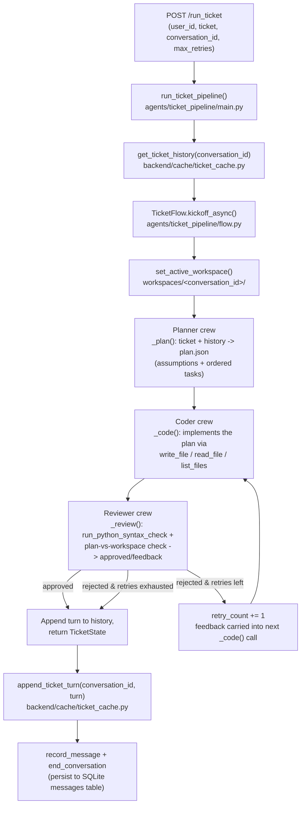

# Amper Bot — Ticket-to-Code Agent Pipeline

Amper is a multi-agent pipeline built on [CrewAI](https://github.com/crewAIInc/crewAI) and
[FastAPI](https://fastapi.tiangolo.com/) that takes a natural-language feature ticket and
drives it, autonomously, to written code on disk. Three coordinated agent roles — **Planner**,
**Coder**, and **Reviewer** — turn a short product request into an ordered technical plan,
an implementation of that plan, and a pass/fail review that can send the work back for another
attempt.

## Table of contents

1. [Overview](#overview)
2. [Pipeline architecture](#pipeline-architecture)
3. [Project structure](#project-structure)
4. [Prerequisites](#prerequisites)
5. [Installation](#installation)
6. [Usage](#usage)
7. [Configuration](#configuration)
8. [Known limitations](#known-limitations)
9. [How to extend it](#how-to-extend-it)
10. [Notes / discrepancies detected](#notes--discrepancies-detected)

---

## Overview

Amper Bot exists to close the gap between "someone wrote a one-line feature ticket" and
"there is working code that implements it." Instead of a single LLM call that guesses at an
implementation, the ticket is broken into an explicit, ordered task list by a **Planner**
agent, implemented file-by-file by a **Coder** agent using real file-system tools, and then
checked by a **Reviewer** agent that can reject the attempt with specific feedback. Rejected
work is looped back to the Coder, with the Reviewer's feedback injected directly into its next
attempt, up to a configurable number of retries — a self-correcting loop rather than a single
best-effort generation.

The pipeline is exposed through a small FastAPI backend (`backend/`) with a persistence layer
(SQLite via SQLAlchemy, plus in-memory caches for live conversation state) and a vanilla
JavaScript chat UI (`static/`). The intent, per the project's design, is a multi-turn chat: a
ticket triggers a full Planner → Coder → Reviewer run, and a follow-up message on the same
conversation (e.g. "agrégale también X") is meant to be treated as an amendment to the existing
plan rather than a brand-new ticket. See [Notes / discrepancies detected](#notes--discrepancies-detected)
for where the current code does and doesn't deliver on that intent end-to-end.

Every LLM call in the ticket pipeline goes through Gemini on **Vertex AI** (not the public
Gemini API), using a single shared `LLM` client (`agents/common/llm.py`) that all three agents
reuse.

## Pipeline architecture

### Step by step



### Narrative

1. **Entry point.** `POST /run_ticket` (`backend/api/routes.py`) receives `user_id`, `ticket`,
   an optional `conversation_id`, and `max_retries` (default `3`). If no `conversation_id` is
   supplied, a new UUID is minted — this is what scopes a conversation's memory and its
   on-disk workspace.
2. **History load.** `run_ticket_pipeline()` (`agents/ticket_pipeline/main.py`) loads prior
   turns for that `conversation_id` from `backend/cache/ticket_cache.py` — an in-memory list
   of previous `{ticket, plan, code_summary, approved, retries_used}` records — and hands them
   to a fresh `TicketFlow`.
3. **Workspace.** `TicketFlow.run()` (`agents/ticket_pipeline/flow.py`) resolves a per-conversation
   directory, `workspaces/<conversation_id>/`, and registers it as the *active workspace* via a
   `contextvar` (`agents/ticket_pipeline/tools.py::set_active_workspace`) so every file tool call
   made by the Coder/Reviewer that turn is scoped to it, with a path-traversal guard.
4. **Planner.** A one-agent, one-task Crew runs `build_plan_task()` with the ticket text and a
   flattened summary of prior turns. The Planner is instructed to make its own reasonable
   assumptions instead of asking for clarification, and — when history is present — to extend
   or amend the most recent plan rather than starting over, which is what makes a follow-up
   like "agrégale también X" behave as an iteration. Output is parsed as strict JSON
   (`{"assumptions": [...], "tasks": [{"id", "description"}, ...]}`) into `TicketState.plan`.
5. **Coder ⇄ Reviewer retry loop.** A bounded `while True` loop:
   - `_code()` runs a Coder crew against the current plan. On any attempt after the first, the
     task description is built with the Reviewer's previous rejection feedback prepended, so
     the Coder is explicitly told to "fix exactly what it flags before doing anything else."
     The Coder writes real files into the workspace using its `write_file`/`read_file`/`list_files`
     tools.
   - `_review()` runs a Reviewer crew that first runs `run_python_syntax_check` (compiles every
     `.py` file with `py_compile`) and then checks the workspace against every task in the plan,
     returning strict JSON (`{"approved": bool, "feedback": str}`).
   - If `approved` is true, the loop breaks immediately.
   - Otherwise, if `retry_count >= max_retries`, the loop breaks anyway and the last (rejected)
     attempt is returned as final — the pipeline never blocks indefinitely.
   - Otherwise `retry_count` is incremented and the loop repeats, re-running `_code()` with the
     new feedback.
   - With the default `max_retries=3`, this allows up to **4 total Coder attempts** (the first
     attempt plus 3 retries) before giving up.
6. **Turn recorded.** Whether or not it was ultimately approved, the turn (`ticket`, `plan`,
   `code_summary`, `approved`, `retries_used`) is appended to `TicketState.history` and returned.
7. **Cross-turn memory persisted.** Back in `run_ticket_pipeline()`, that last turn is written
   into `ticket_cache` via `append_ticket_turn(conversation_id, ...)` — this is what the *next*
   call for the same `conversation_id` will load in step 2, closing the loop for multi-turn
   context.
8. **Chat/message persistence.** The route also stores the raw user/assistant messages via
   `backend/services/chat.py::record_message` (buffered in `backend/cache/conversation_cache.py`)
   and flushes them, plus a short summary, into the SQLite `messages` table via `end_conversation`.
   This is a separate memory mechanism from `ticket_cache` — see
   [Known limitations](#known-limitations).

### Retry cycle in short

```
attempt 1: Coder implements plan  -> Reviewer rejects, gives feedback
attempt 2: Coder fixes per feedback -> Reviewer rejects again, gives new feedback
   ...
attempt N (N = max_retries + 1): Coder's last shot -> approved, OR retries exhausted
                                                        (last attempt returned regardless)
```

## Project structure

```
amper_bot/
├── agents/
│   ├── common/
│   │   └── llm.py                # Shared Vertex-backed Gemini LLM client for every agent
│   └── ticket_pipeline/
│       ├── agent.py               # Planner / Coder / Reviewer Agent definitions
│       ├── tools.py                # Workspace-scoped file tools + syntax checker
│       ├── tasks.py                # Task *factories* (plan/code/review), rebuilt each retry
│       ├── flow.py                 # TicketFlow: the orchestrator + TicketState model
│       └── main.py                 # run_ticket_pipeline(): public entry point + history wiring
├── backend/
│   ├── app.py                      # FastAPI app: mounts /static, includes the router, serves index.html
│   ├── main.py                     # get_db() dependency + init_db() (see Limitations)
│   ├── db.py                       # SQLAlchemy engine/session/Base, sqlite:///./backend.db
│   ├── api/
│   │   └── routes.py               # HTTP surface: /run, /run_ticket, /end_conversation, /get_history, /delete_conversation
│   ├── cache/
│   │   ├── conversation_cache.py   # In-memory (user_id, conversation_id) -> [messages] buffer
│   │   └── ticket_cache.py         # In-memory conversation_id -> [ticket turns]; the pipeline's cross-turn memory
│   ├── services/
│   │   ├── chat.py                 # Raw-SQL persistence for messages/history (record/end/load/delete)
│   │   ├── research.py             # run_query(): stub used by /run (see Discrepancies)
│   │   └── bot/
│   │       ├── model.py            # BotModel: thin Vertex AI GenerativeModel wrapper (Gemini 2.0 Flash)
│   │       └── summary.py          # Summary: prompts BotModel for a short JSON conversation title
│   └── tests/                      # Empty — no automated tests currently
├── static/
│   ├── index.html                  # Chat UI shell ("Agentic Research Studio")
│   ├── css/app.css                 # UI styling
│   ├── js/api.js                   # fetch() wrappers for /get_history, /run, /delete_conversation
│   ├── js/app.js                   # UI state/behavior: sends messages, renders history, agent trace panel
│   └── images/ammper-logo.png      # Brand logo used in the header
├── .claude/settings.local.json     # Local Claude Code permission allowlist (tooling, not app config)
├── .gitignore                      # Currently empty (see Limitations)
└── bot_env/                        # Local Python virtualenv (see Limitations — appears to be committed)
```

Role of each piece inside the pipeline:

- **`agents/common/llm.py`** builds the single `LLM` instance (`gemini-flash-lite-latest`,
  `temperature=0.5`) shared by the Planner, Coder, and Reviewer agents. It loads Vertex AI
  credentials from `GOOGLE_APPLICATION_CREDENTIALS` or a hardcoded fallback JSON filename at
  the repo root, falling back to an empty credentials payload if neither exists.
- **`agents/ticket_pipeline/agent.py`** declares the three `Agent` objects. Only the Coder and
  Reviewer get tools — the Planner is pure reasoning over text.
- **`agents/ticket_pipeline/tools.py`** is what lets the Coder/Reviewer touch the filesystem
  safely: `write_file`, `read_file`, `list_files` and `run_python_syntax_check`, all resolved
  against a `ContextVar`-tracked "active workspace" (set once per `TicketFlow.run()` call) with
  a check that rejects any path that would resolve outside that workspace.
- **`agents/ticket_pipeline/tasks.py`** builds a *new* `Task` object per call rather than reusing
  module-level singletons, because the Coder/Reviewer task description changes every retry
  (the rejection feedback is baked into the description text).
- **`agents/ticket_pipeline/flow.py`** is the orchestrator: `TicketState` (the Pydantic model
  carrying ticket, history, plan, retry count, etc.) and `TicketFlow`, a CrewAI `Flow` with a
  single `@start()` method that runs the Planner once and then loops Coder → Reviewer with the
  bounded-retry logic described above.
- **`agents/ticket_pipeline/main.py`** is the only function the backend calls into:
  `run_ticket_pipeline()` loads history from `ticket_cache`, kicks off `TicketFlow`, and writes
  the resulting turn back to `ticket_cache`.
- **`backend/app.py` / `backend/api/routes.py`** are the HTTP layer: `routes.py` is where
  `run_ticket_pipeline` actually gets invoked (`/run_ticket`), plus the conversation-history CRUD
  endpoints the sidebar UI depends on.
- **`backend/cache/ticket_cache.py`** is the pipeline's actual cross-turn memory — it's what
  makes step 2/7 of the pipeline above possible. **`backend/cache/conversation_cache.py`** is a
  separate, parallel buffer purely for the raw chat transcript that eventually gets written to
  SQL.
- **`backend/services/chat.py`** persists finished conversations (raw SQL against `messages`)
  and loads/deletes them for the sidebar.
- **`backend/services/bot/model.py` + `summary.py`** are unrelated to the Planner/Coder/Reviewer
  loop — they're a separate, small Gemini call used to generate a short conversation title.
  `research.py` imports both but (today) never calls them — see
  [Notes / discrepancies detected](#notes--discrepancies-detected).
- **`static/`** is the browser chat client: it lists past conversations, lets you type a
  message, and renders a (currently client-side-only, mocked) "agent trace" panel.

## Prerequisites

- **Python 3.12** (the committed `bot_env/` virtualenv is built against 3.12.10; there is no
  pinned minimum elsewhere in the repo).
- **A Google Cloud project with the Vertex AI API enabled.** Both the ticket pipeline
  (`agents/common/llm.py`) and the conversation-title bot (`backend/services/bot/model.py`) call
  Gemini through Vertex AI, not the public `generativelanguage.googleapis.com` API — you need a
  GCP project, not just a Gemini API key.
- **A service account JSON key** with Vertex AI permissions, pointed to by
  `GOOGLE_APPLICATION_CREDENTIALS`, or dropped at the repo root under the filename
  `agentic-ai-project-485616-eb1a03e20e28.json` (the hardcoded fallback in `llm.py`).
- **`PROJECT_ID`** environment variable — read by `BotModel.__init__` for its Vertex AI project.
- **Python packages actually imported by the code** (there is no `requirements.txt` or
  `pyproject.toml` in the repo — see [Limitations](#known-limitations) — so install these
  directly): `crewai`, `fastapi`, `uvicorn`, `sqlalchemy`, `pydantic`, `python-dotenv`,
  `google-auth`, and `google-cloud-aiplatform` (provides the `vertexai` module used in
  `backend/services/bot/model.py`; note it is **not** currently installed in the committed
  `bot_env/`, so `BotModel` runs in its no-op fallback mode out of the box).

## Installation

```bash
# 1. Clone
git clone <repo-url> amper_bot
cd amper_bot

# 2. Create and activate a virtual environment
python -m venv bot_env
# Windows
bot_env\Scripts\activate
# macOS/Linux
source bot_env/bin/activate

# 3. Install dependencies (no lockfile is committed — see Limitations)
pip install crewai fastapi "uvicorn[standard]" sqlalchemy pydantic python-dotenv \
            google-auth google-cloud-aiplatform

# 4. Configure environment variables
```

Create a `.env` file at the repo root (both `agents/common/llm.py` and
`backend/services/bot/model.py` call `load_dotenv()`):

```dotenv
GOOGLE_APPLICATION_CREDENTIALS=C:\path\to\service-account.json
PROJECT_ID=your-gcp-project-id
```

Alternatively, place the service-account key file at the repo root named
`agentic-ai-project-485616-eb1a03e20e28.json` — `agents/common/llm.py` will pick it up
automatically without setting `GOOGLE_APPLICATION_CREDENTIALS`.

**Database schema.** No code in this repo currently creates the SQLite tables that
`backend/services/chat.py` reads and writes (`backend/main.py::init_db()` references a
`backend/models.py` module that does not exist, and is not called from anywhere — see
[Notes / discrepancies detected](#notes--discrepancies-detected)). Until that's fixed, create
the tables `chat.py`'s raw SQL expects before using conversation history:

```bash
python - <<'PY'
import sqlite3
conn = sqlite3.connect("backend.db")
conn.execute("""
    CREATE TABLE IF NOT EXISTS messages (
        id INTEGER PRIMARY KEY AUTOINCREMENT,
        user_id TEXT,
        conversation_id TEXT,
        messages TEXT,
        summary TEXT,
        created_at TIMESTAMP
    )
""")
conn.execute("""
    CREATE TABLE IF NOT EXISTS users_history (
        id INTEGER PRIMARY KEY AUTOINCREMENT,
        user_id TEXT,
        history TEXT
    )
""")
conn.commit()
conn.close()
PY
```

This mirrors exactly the columns referenced by `backend/services/chat.py`'s `INSERT`/`SELECT`
statements. The `messages`/`created_at`/`summary` columns back `/end_conversation` and
`/get_history`; `users_history` backs the unused legacy helpers (`get_user_history`,
`append_history`).

## Usage

### Run the server

```bash
uvicorn backend.app:app --reload
```

This serves the chat UI at `http://localhost:8000/` and the FastAPI docs (Swagger UI) at
`http://localhost:8000/docs`.

### Sending a ticket through the real pipeline

The chat UI in `static/` currently posts to `/run`, which does **not** run the agent pipeline
(see [Notes / discrepancies detected](#notes--discrepancies-detected)). To actually exercise
Planner → Coder → Reviewer today, call `POST /run_ticket` directly — e.g. from `/docs`, or with
`curl`:

```bash
curl -X POST "http://localhost:8000/run_ticket" \
  --get \
  --data-urlencode "user_id=carlos" \
  --data-urlencode "ticket=Add a /health endpoint that returns {\"status\": \"ok\"}" \
  --data-urlencode "max_retries=3"
```

A first response looks like:

```json
{
  "conversation_id": "b6b9b7b2-...-generated-uuid",
  "plan": {
    "assumptions": ["Use FastAPI's existing router pattern"],
    "tasks": [
      {"id": "T1", "description": "Add a GET /health route returning {\"status\": \"ok\"}"}
    ]
  },
  "code_summary": "src/health.py: new /health route returning a static status payload.",
  "approved": true,
  "retries_used": 0,
  "error": null
}
```

### Sending a follow-up on the same conversation

Reuse the `conversation_id` from the previous response as `conversation_id` on the next call —
this is what makes the Planner treat the message as an amendment instead of a new ticket:

```bash
curl -X POST "http://localhost:8000/run_ticket" \
  --get \
  --data-urlencode "user_id=carlos" \
  --data-urlencode "ticket=agrégale también un campo timestamp a la respuesta" \
  --data-urlencode "conversation_id=b6b9b7b2-...-generated-uuid" \
  --data-urlencode "max_retries=3"
```

The Planner is given the prior turn's `ticket`/`plan`/`approved` status as context and is
instructed to extend the previous plan rather than start over.

Generated files land on disk under `workspaces/<conversation_id>/` at the repo root.

### Configuring the Reviewer's retry limit

`max_retries` is a request-level parameter on `/run_ticket` (default `3` if omitted) — it is
**not** an environment variable. It flows: query param → `run_ticket_pipeline(max_retries=...)`
→ `TicketFlow` input → `TicketState.max_retries`, which bounds the Coder/Reviewer loop described
in [Pipeline architecture](#pipeline-architecture).

## Configuration

| Setting | Where | Default | Notes |
|---|---|---|---|
| `GOOGLE_APPLICATION_CREDENTIALS` | env var (`.env`) | fallback JSON at repo root | Vertex AI credentials for the ticket pipeline's shared LLM |
| `PROJECT_ID` | env var (`.env`) | none | Vertex AI project for `BotModel` (conversation title generator) |
| Ticket pipeline model | `agents/common/llm.py` | `gemini-flash-lite-latest`, `temperature=0.5` | Shared by Planner, Coder, and Reviewer — no per-role model today |
| Title-summary model | `backend/services/bot/model.py::BotModel.__init__` | `gemini-2.0-flash`, `location="us-east4"` | Unrelated to the ticket pipeline; `max_output_tokens=15` |
| `max_retries` | `/run_ticket` query param → `TicketState.max_retries` | `3` | Bounds the Coder/Reviewer retry loop (see [Pipeline architecture](#pipeline-architecture)) |
| Workspace root | `agents/ticket_pipeline/flow.py::WORKSPACES_ROOT` | `<repo_root>/workspaces` | Hardcoded; one subdirectory per `conversation_id` |
| SQLite DB path | `backend/db.py::SQALCHEMY_DATABASE_URL` | `sqlite:///./backend.db` | Relative to the process's working directory |

## Known limitations

- **In-memory memory only.** Both `backend/cache/ticket_cache.py` (the pipeline's cross-turn
  history) and `backend/cache/conversation_cache.py` (the raw chat buffer) are plain
  `dict`/`defaultdict` objects in process memory. Restarting the server silently drops all
  pending conversation context — including the ticket history that a follow-up message like
  "agrégale también X" depends on to be understood as an amendment.
- **One shared model for three distinct roles.** Planner, Coder, and Reviewer all use the same
  `LLM` instance from `agents/common/llm.py` — there's no built-in way to give the Reviewer a
  stronger/cheaper/different model than the Coder without editing `agent.py`.
- **Credential failures surface late.** If neither `GOOGLE_APPLICATION_CREDENTIALS` nor the
  hardcoded fallback JSON file exists, `agents/common/llm.py` silently builds the `LLM` with an
  empty credentials payload (`"{}"`); the failure only appears once a crew actually tries to
  call the model, not at process startup.
- **Reviewer's rejection isn't a hard stop.** When `max_retries` is exhausted without approval,
  the pipeline still returns the last (rejected) attempt with `"approved": false` — callers must
  check that field themselves; there's no distinct error/exception for "gave up."
- **Syntax checking is Python-only.** `run_python_syntax_check` (`agents/ticket_pipeline/tools.py`)
  only compiles `.py` files with `py_compile`; if the Coder writes files in another language, the
  Reviewer has no automated correctness signal for them beyond reading the file contents itself.
- **No automated tests.** `backend/tests/` exists but is empty.
- **Repo hygiene.** `.gitignore` is currently empty, and `git status` shows the `bot_env/`
  virtualenv's contents as tracked/modified files — the virtual environment appears to be
  committed to version control rather than excluded from it. Generated `workspaces/<id>/` output
  and `backend.db` are similarly not excluded.

## How to extend it

**Add a fourth agent role** (e.g. a "Tester" that runs after the Reviewer approves):

1. Define the new `Agent` in `agents/ticket_pipeline/agent.py` (role, goal, backstory, tools).
2. If it needs file access, add/reuse tools in `agents/ticket_pipeline/tools.py`.
3. Add a task factory for it in `agents/ticket_pipeline/tasks.py` (follow the existing
   `build_review_task()` pattern if it needs to run once per attempt, or the `build_code_task()`
   pattern if its prompt needs to change based on prior feedback).
4. Wire a new `_step_name()` method into `TicketFlow.run()` in `agents/ticket_pipeline/flow.py`,
   call it in the sequence you want, and add any new fields it needs to persist onto
   `TicketState`.

**Change which model an agent uses:**

- To change the model for *all three* existing agents at once, edit the `LLM(...)` call in
  `agents/common/llm.py`.
- To give a single agent its own model, construct a separate `LLM(...)` in `agent.py` and pass
  it as that `Agent`'s `llm=` argument instead of the shared `llm` import.
- To change the conversation-title model (unrelated to the ticket pipeline), edit the
  `model_name`/`location` defaults in `backend/services/bot/model.py::BotModel.__init__`.

**Change the default retry limit:** edit `TicketState.max_retries`'s default in
`agents/ticket_pipeline/flow.py`, or the `max_retries: int = 3` default in
`backend/api/routes.py::run_ticket`.

**Persist ticket history across restarts:** replace the in-memory dict in
`backend/cache/ticket_cache.py` with a real table, following the same pattern
`conversation_cache.py` already uses to flush into the `messages` table via
`backend/services/chat.py::end_conversation` (its own module docstring calls this out directly).

**Connect the chat UI to the real pipeline:** point `static/js/app.js::sendMessage()` at
`POST /run_ticket` (and surface `max_retries` as a UI control) instead of `POST /run`, and either
fix or retire `backend/services/research.py::run_query()` and the `/run` route accordingly.

## Notes / discrepancies detected

The task description this README was written against states that the pipeline is triggered
from a multi-turn chat, and that the system preserves cross-turn context so follow-ups are
understood as iterations. The code substantially implements that *mechanism* (see
[Pipeline architecture](#pipeline-architecture)), but it is not fully wired end-to-end. Specific
gaps found while reading the code:

1. **The chat UI does not trigger the agent pipeline.** `static/js/app.js::sendMessage()` posts
   to `POST /run`. `backend/api/routes.py::run_agent` handles `/run` by calling
   `backend/services/research.py::run_query()`, which is a hardcoded stub:
   ```python
   def run_query():
       summary = "Summary from run_query"
       result = "Result from run_query"
       return result, summary
   ```
   It ignores `user_id`, `query`, and `conversation_id` entirely and never calls
   `run_ticket_pipeline`. The real Planner → Coder → Reviewer flow only runs behind
   `POST /run_ticket`, which nothing in `static/` ever calls. As shipped, submitting a ticket
   through the chat window does not produce any code.
2. **`/run`'s own parameter binding is broken**, independent of the above: it mixes plain
   `user_id: str` / `query: str` parameters with `file: Optional[UploadFile] = File(None)`
   without wrapping the scalar fields in `Form(...)`. FastAPI will look for `user_id`/`query` as
   query-string parameters rather than the multipart form fields `app.js` actually sends,
   which would fail request validation — currently masked only because `run_query()` never reads
   its arguments anyway.
3. **Cross-turn memory is real, but scoped only to `/run_ticket`.** `backend/cache/ticket_cache.py`
   does exactly what the brief describes — the Planner receives prior turns and treats follow-ups
   as amendments — but since the chat UI calls `/run`, not `/run_ticket`, that mechanism is never
   exercised through the UI described in this project's brief.
4. **Two of the five HTTP endpoints call their service functions with mismatched arguments and
   will raise at runtime:**
   - `GET /get_history` calls `load_user_history(user_id, db)`
     (`backend/api/routes.py`), but `load_user_history`'s signature is `(db, user_id)`
     (`backend/services/chat.py`) — the session object and the user id are swapped, so the first
     `db.execute(...)` call inside it will raise `AttributeError` (a `str` has no `.execute`).
     The frontend additionally calls `/get_history` without a `user_id` at all
     (`static/js/api.js::getHistory`), which would independently fail FastAPI's required-query-
     parameter validation.
   - `DELETE /delete_conversation` calls `delete_conversation(conversation_id, db)`
     (`backend/api/routes.py`), but `delete_conversation`'s signature is
     `(user_id, db, conversation_id)` (`backend/services/chat.py`) — one argument short, so this
     raises `TypeError: delete_conversation() missing 1 required positional argument:
     'conversation_id'` before it can run.
   Both endpoints back the conversation-history sidebar in the UI, so that part of the app is
   currently non-functional regardless of the ticket-pipeline issues above.
5. **`backend/main.py::init_db()` cannot run and is never called.** It does
   `from backend import models` and `models.Base.metadata.create_all(...)`, but no
   `backend/models.py` exists anywhere in the repo, and no code path (including
   `backend/app.py`'s startup) calls `init_db()` at all. Nothing in the codebase actually creates
   the `messages`/`users_history` tables that `backend/services/chat.py` depends on via raw SQL —
   see the manual schema workaround in [Installation](#installation).
6. **The UI's own copy describes a different, apparently earlier project.** `static/index.html`
   and `static/js/app.js` present the app as a "Research assistant" where "the CrewAI workflow
   will inspect the schema, build a query, and return an answer," and `backend/services/research.py`
   imports a `Summary` class it never calls. No schema-inspection or query-planning agent exists
   in the current repo — only `agents/ticket_pipeline` and the shared `agents/common/llm.py` do —
   suggesting the frontend and `research.py` are leftovers from an earlier iteration of this
   project that predates the ticket pipeline.
7. **No dependency manifest.** There is no `requirements.txt`, `pyproject.toml`, or `Pipfile` in
   the repo; the package list in [Prerequisites](#prerequisites)/[Installation](#installation)
   was reconstructed from the imports in the source files and the packages actually present in
   the committed `bot_env/` virtualenv, not from a declared manifest.
