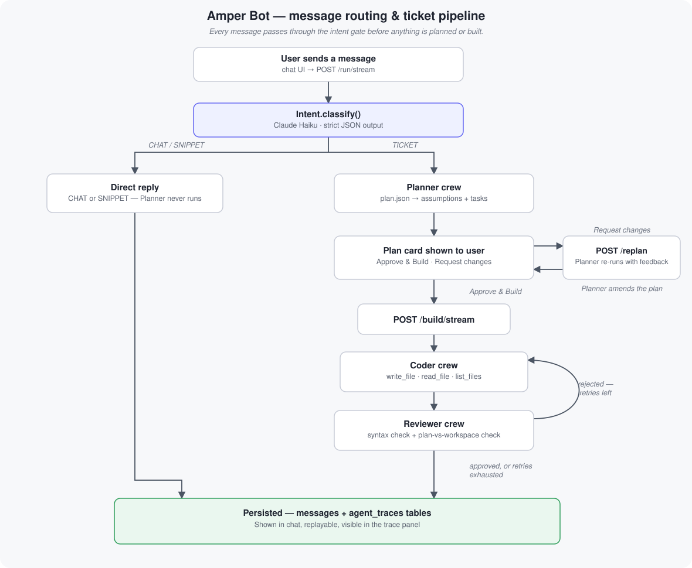

# Amper Bot — Ticket-to-Code Agent

Amper is a chat assistant built on [CrewAI](https://github.com/crewAIInc/crewAI),
[FastAPI](https://fastapi.tiangolo.com/), and Anthropic's Claude models. It sits in front of a
three-agent pipeline — **Planner**, **Coder**, **Reviewer** — that turns a short, natural-language
feature ticket into an ordered technical plan, an implementation of that plan, and a pass/fail
review that can send the work back for another attempt.

Not every message is a ticket, though:
a lightweight classifier sits in front of the pipeline so a quick question ("what can you do?")
or a self-contained code request ("give me a FastAPI hello-world script") gets answered directly
instead of being forced into a fake implementation plan.

Anything outside coding/planning
work for this product (weather, sports, book recommendations, and the like) is declined rather
than answered.

## Table of contents

- [Amper Bot — Ticket-to-Code Agent](#amper-bot--ticket-to-code-agent)
  - [Table of contents](#table-of-contents)
  - [Overview](#overview)
  - [Architecture](#architecture)
  - [Project structure](#project-structure)
  - [What the assistant can and can't answer](#what-the-assistant-can-and-cant-answer)
  - [Limits](#limits)
  - [The ticket pipeline](#the-ticket-pipeline)
  - [The Coder/Reviewer retry loop](#the-coderreviewer-retry-loop)
  - [How responses are generated](#how-responses-are-generated)
  - [Cache handling](#cache-handling)
  - [Agent trace](#agent-trace)
  - [Prerequisites](#prerequisites)
  - [Installation](#installation)
  - [Usage](#usage)
  - [HTTP API reference](#http-api-reference)
  - [Known limitations](#known-limitations)
  - [Legacy / unused code](#legacy--unused-code)

---

## Overview

A message sent from the chat UI goes through two layers before anything gets built:

1. **Intent routing.** A cheap, fast classification call decides whether the
   message is a `TICKET`, a `SNIPPET`, or `CHAT`
   - `SNIPPET`
   and `CHAT` are answered directly and never reach the Planner.
   - `TICKET` proceeds to step 2.
2. **The ticket pipeline.**:

    - **Planner** agent breaks the ticket into an explicit, ordered task
   list with any assumptions it had to make. That plan is shown to the user as an editable card. The user can approve it, edit tasks inline first, or send feedback forthe Planner to revise.
    - **Coder** agent implements every task using real
   file-system tools
   - **Reviewer** agent checks the result against the plan. A rejection
   sends the Coder back with the Reviewer's specific feedback, up to a bounded number of retries
   (see [The Coder/Reviewer retry loop](#the-coderreviewer-retry-loop)).

Both layers stream real progress to the UI over Server-Sent Events instead of a static "loading", a phase label plus a live elapsed-time counter and live file-by-file output while the Coder writes code.

Conversations persist to a SQLite database and are replayable from the sidebar

## Architecture



1. **Intent gate.** `Intent` (`backend/services/bot/intent.py`) is a single Claude Haiku call
   constrained to strict JSON output. It looks at the whole conversation history, not just the
   latest message, and fails safe toward `TICKET` on any error — silently dropping a real request
   is worse than the Planner making an assumption about a message it didn't need to see.
2. **CHAT / SNIPPET.** Answered directly from that same Haiku call's `reply` field — no separate
   round trip, and the Planner never runs.
3. **TICKET.** `start_plan()` (`backend/services/research.py`) hands the ticket to `plan_ticket()`
   (`agents/ticket_pipeline/main.py`), which kicks off the Planner.
4. **Approval loop.** The Planner's plan is shown to the user as an editable card. `POST /replan`
   re-runs the Planner with the user's feedback against that same pending plan; `POST
   /build`/`/build/stream` is what actually starts the Coder ⇄ Reviewer loop, once approved.
5. **Persistence.** Every turn — chat reply, snippet, plan, or build result — is written to the
   SQLite `messages` table, and every agent decision along the way to `agent_traces` (see
   [Agent trace](#agent-trace)).

Each conversation gets its own workspace directory, `workspaces/<conversation_id>/`, registered as
the *active workspace* via a `ContextVar` (`agents/ticket_pipeline/tools.py`) so every file tool
call that turn is scoped to it, with a path-traversal guard.

## Project structure

Folders only — see each folder's own files for detail.

```text
amper_bot/
├── agents/
│   ├── common/            # Shared Claude (Anthropic) LLM client used by Planner/Coder/Reviewer
│   ├── ticket_pipeline/   # The live pipeline: agent definitions, file tools, task factories,
│   │                      # the Planner/Coder/Reviewer flow, and the SSE progress event bridge
│   └── research/          # Unused legacy module -- see Legacy / unused code
├── backend/
│   ├── api/               # The whole FastAPI HTTP surface (see HTTP API reference)
│   ├── cache/             # In-memory, per-process stores: pending plans, per-turn staging
│   │                      # buffer, completed build history (see Cache handling)
│   ├── services/          # Intent gate + Planner/Coder orchestration, message persistence,
│   │   └── bot/           # trace read/write; bot/ holds the Intent classifier and the
│   │                      # conversation-title summarizer
│   └── tests/             # Empty -- no automated tests currently
├── static/
│   ├── css/               # UI styling (plan cards, modal, light/dark theme)
│   ├── js/                # All chat UI behavior: sending, streaming, plan cards, replay,
│   │                      # file/trace side panes
│   └── img/                # Diagram assets referenced from this README
├── workspaces/            # Generated per-conversation; where the Coder actually writes files
└── requirements.txt       # Full dependency list (includes unused legacy deps -- see below)
```

## What the assistant can and can't answer

Every message is classified by the intent gate into exactly
one of three buckets before anything else happens:

- **TICKET** — a concrete request to build, change, fix, or investigate something in *this
  product's own codebase*. Goes to the Planner → Coder → Reviewer pipeline.
- **SNIPPET** — a self-contained technical/programming question that has nothing to do with this
  product's codebase (e.g. "write me a regex for emails", "how does Python's GIL work"). Answered
  directly, with real working code when code was asked for.
- **CHAT** — everything else, and it covers two different situations under one label:
  - *Small talk / about the assistant* — greetings, "what can you do?" — answered normally.
  - *Off-topic, general-knowledge questions* — prices, sports results, weather forecasts. These are **never answered**, not even partially or "just this once" — the reply
    states plainly that it's outside what the assistant helps with and redirects toward
    planning/building features or fixes instead, in the same language the user wrote in.

The distinction between SNIPPET and the off-topic half of CHAT matters: a programming question
gets a real, code-capable answer even though it's unrelated to this product, while a
general-knowledge question gets declined regardless of how quick it would be to answer.

## Limits

  1. Attachments

- One file per message
- A readable attachment's text is capped at **20,000 characters**
- Recognized, **but unreadable** formats — PDF, zip-based Office documents (DOCX/XLSX/PPTX), ZIP,
  PNG/JPEG/GIF there's no OCR step yet.

2. Tokens
- Agents share one model call budget tokens
- The Intent classifier is capped, but enough for a short SNIPPET code answer
  alongside the classification itself.
- The conversation-title summarizer is capped

Both sets of limits are hardcoded today, not exposed as user-facing settings.

## The ticket pipeline

Once a message is classified as `TICKET`, three agents do the
actual work, in this order:

- **Planner** — turns the ticket into a concrete, ordered list of tasks. When something is
  ambiguous, it makes the most reasonable assumption and states it explicitly rather than asking
  for clarification. On a "request changes" turn, it amends the
  existing plan instead of starting over.
- **Coder** — implements every task using real file-system tools, writing actual files rather than describing what it would write. On a retry, the
  Reviewer's feedback from the previous attempt is its single most important input.
- **Reviewer** — checks every file in the workspace against every task in the plan, running a
  Python syntax check first, and returns a strict `{"approved": bool, "feedback": str}` verdict.
  Rejection feedback is specific enough for the Coder to act on directly, without a follow-up
  question.

## The Coder/Reviewer retry loop

Once a plan is approved, `TicketBuildFlow.run()` runs:

```text
loop:
    Coder implements the plan (the last rejection's feedback, if any, is prepended to its task)
    Reviewer checks the result (syntax check first, then plan-vs-workspace)
    if approved                       -> stop, return the result
    if retries used >= max_retries    -> stop, return the LAST attempt anyway
    otherwise                         -> increment the retry count, loop again
```

- `max_retries` defaults to `3`, so up to **4 total Coder attempts** (the first attempt plus 3
  retries).
- Every round is written to the agent trace (a `CODER` step followed by a `REVIEWER` step, per
  attempt), so a rejection cycle stays fully auditable after the fact.
- **If the Reviewer still hasn't approved once `max_retries` is exhausted, the loop does not keep
  going or block indefinitely.** It stops and returns the *last* Coder attempt as-is, with
  `"approved": false`. A `SYSTEM` / `max_retries_reached` step is recorded to the trace, the
  attempt is still persisted and shown to the user rather than silently discarded, and the UI
  makes the outcome explicit — a "Build finished with open feedback" toast and the message card
  visually marked as not approved — instead of presenting a rejected result as a success.

## How responses are generated

Two different things are easy to conflate here:

- **Phase status is real-time.** Labels like "Reading your message…", "Writing the code…", and
  "Reviewing the changes…" are pushed to the UI over Server-Sent Events the moment they happen,
  each paired with a live elapsed-time counter that resets to zero at the start of every new
  phase.
- **The reply content itself is not token-streamed.** The plan JSON, a SNIPPET's code answer, a
  CHAT reply, and the Reviewer's verdict are each generated as one complete, constrained call
  before anything is shown — then revealed in the chat with a capped-duration, client-side typing
  animation (`appendMessageTyped()` in `static/js/app.js`). That animation is purely cosmetic: the
  full response already exists before the first character appears on screen.

This is deliberate:

- The plan and the Reviewer's verdict are parsed as strict JSON. There's no meaningful "partial"
  version of `{"approved": false, "feedback": "..."}` to render mid-stream, and a half-formed JSON
  object isn't renderable as a plan card either.
- The retry loop needs each attempt's *complete* output to decide whether to retry at all — a
  code file or a review verdict that's still being generated isn't something the loop can act on.
- It means a response is only ever shown once it's already known to be valid — a JSON parse
  failure is caught and surfaced as an error before the user sees anything, rather than after
  they've watched it "type" for several seconds only to fail.

## Cache handling

Three separate in-memory stores exist, each with a different lifetime and purpose:

- **`backend/cache/conversation_cache.py`** — a per-turn staging buffer only. `end_conversation()`
  flushes it to a new database row and clears it after every turn. Anything that needs to know
  "what's been said so far" (the intent classifier, the summary generator) reads from
  `backend/services/chat.py::get_conversation_history()` instead, which queries the database
  directly — this is what survives the per-turn cache clear and makes follow-up messages work.
- **`backend/cache/plan_cache.py`** — holds a plan awaiting approval, keyed by `conversation_id`,
  so `POST /build`/`/replan` can pick it back up.
- **`backend/cache/ticket_cache.py`** — holds completed build turns, so the Planner can treat a
  follow-up ticket as an amendment rather than an unrelated new request.

`plan_cache` and `ticket_cache` are plain Python dicts scoped to one process — neither survives a
server restart, and neither would be shared correctly across multiple `uvicorn` workers (see
[Known limitations](#known-limitations)).

## Agent trace

Every agent decision — the Intent classifier's verdict on every message, plus the Planner's plan
and each Coder/Reviewer attempt for a ticket — is recorded as a short, structured step
(`{agent, decision, reasoning, timestamp}`) in its own `agent_traces` table, separate from the
visible chat transcript. The point is to make retries and rejections auditable without cluttering
the conversation itself with every attempt's internals — most users don't want to see that by
default. It's surfaced on demand two ways: `GET /trace`, and the "View agent trace" side panel in
the UI, which re-fetches after every turn while it's open.

## Prerequisites

- **Python 3.12**
- **An Anthropic API key** 
- Dependencies from `requirements.txt` (see [Installation](#installation)).

## Installation

```bash
# 1. Clone
git clone <repo-url> amper_bot
cd amper_bot

# 2. Create and activate a virtual environment
python -m venv bot_env
bot_env\Scripts\activate

# 3. Install dependencies
pip install -r requirements.txt
```

Create a `.env` file at the repo root:

```dotenv
ANTHROPIC_API_KEY=sk-ant-...
```

No manual database setup is needed — `backend/app.py`'s startup hook calls
`backend/main.py::init_db()`, which creates the `users`, `messages`, and `agent_traces` tables
(from `backend/models.py`) in `backend.db` automatically if they don't already exist.

## Usage

```bash
uvicorn backend.app:app --reload
```

This serves the chat UI at `http://localhost:8000/` and the FastAPI docs (Swagger UI) at
`http://localhost:8000/docs`. Opening the page always starts on a fresh, empty conversation —
past conversations are listed in the sidebar and only load when clicked.

Type a message and send it:

- **A quick question or standalone code request** ("what can you do?", "give me a simple FastAPI
  script") gets a direct reply in the chat, with a live status label while it's generated. No
  plan, no files written.
- **A real feature/fix request** ("add a dark mode toggle to the settings page") gets a plan
  card: assumptions, an ordered task list (each task is editable inline), and two actions —
  **Request changes** (send feedback, the Planner revises the same plan) or **Approve & Build**
  (kicks off the Coder → Reviewer loop, streaming each file as it's written and the final
  approved/rejected result).

Reopening a past conversation from the sidebar replays it exactly as it looked live — including
rebuilding the same plan card (read-only, no action buttons, since there's no live
`plan_cache`/build state to resume once a conversation's been reloaded from history).

Restarting the server does **not** need to be a black box: `--reload` watches Python source files
and restarts a worker automatically, but it does *not* pick up changes to `.env` — if you rotate
`ANTHROPIC_API_KEY`, restart the server process yourself rather than relying on `--reload` to
notice.

## HTTP API reference

| Endpoint | Method | Purpose |
| --- | --- | --- |
| `/run` | POST | Non-streaming: intent-check, then either a direct reply or a Planner run. Returns `{conversation_id, plan, reply, error}`. |
| `/run/stream` | POST | Streaming counterpart of `/run` — what the chat UI actually uses. SSE `"phase"` events, then a final `"result"`/`"error"` event. |
| `/replan` | POST | Re-runs the Planner with feedback against the pending plan for a conversation. |
| `/build` | POST | Non-streaming Coder → Reviewer run against an approved plan. |
| `/build/stream` | POST | Streaming counterpart of `/build` — what the chat UI actually uses. SSE `"phase"`/`"file"` events, then `"result"`/`"error"`. |
| `/run_ticket` | POST | One-shot Planner → Coder → Reviewer with no approval checkpoint. Not called by the UI — see [Legacy / unused code](#legacy--unused-code). |
| `/get_history` | GET | Returns every saved conversation for a `user_id`, newest first, messages in chronological order. |
| `/delete_conversation` | DELETE | Deletes all rows for a `conversation_id` + `user_id`. |
| `/end_conversation` | POST | Manually flushes+clears the in-memory buffer for a conversation. Not used by the UI (every route above already calls this itself). |
| `/trace` | GET | Every intermediate agent decision recorded for a `conversation_id`. See [Agent trace](#agent-trace). |

## Known limitations

- **`plan_cache` and `ticket_cache` are in-memory only.** A server restart silently drops any
  plan awaiting approval and any build-turn history the Planner uses for amendment context. See
  [Cache handling](#cache-handling).
- **Single-process only.** All three in-memory caches are plain Python dicts scoped to one
  process. Running multiple `uvicorn` workers, or scaling horizontally, would silently break
  approve/build/replan for any request that lands on a different worker than the one that
  created the pending plan. A shared store (e.g. Redis) would be needed before that's viable.
- **No login, no per-user isolation.** Every request shares one conversation pool (`user_id` is a
  plain client-supplied string, hardcoded to `"1"` in `static/js/app.js`).
- **No automated tests.** `backend/tests/` exists but is empty.
- **Syntax checking is Python-only.** `run_python_syntax_check` only compiles `.py` files;
  other languages get no automated correctness signal beyond what the Reviewer reads directly.
- **`requirements.txt` is a full environment dump, not a curated manifest** — it includes
  packages pulled in by the unused legacy code below (`google-cloud-aiplatform`, `openai`,
  `chromadb`, etc.) alongside what the live code path actually needs.

## Legacy / unused code

A few pieces remain in the repo from an earlier iteration of this project and aren't reachable
from the current chat UI or API surface. Nothing here is broken, they're just dead weight:

- **`agents/research/`** — a separate CrewAI flow (schema inspection / query building) that
  predates the ticket pipeline. Nothing in `backend/` imports from it.
- **`backend/services/bot/model.py::BotModel`** — a Vertex AI (Gemini) wrapper, superseded by
  `Summary`/`Intent` (which call Anthropic directly). Not imported anywhere.
- **`static/js/api.js`** — a `fetch()` wrapper module; `static/index.html` never loads it, and
  `static/js/app.js` makes its own `fetch()` calls directly instead.
- **`backend/services/research.py::run_query()`** and **`POST /run_ticket`** — a one-shot,
  no-approval-checkpoint code path kept for completeness. The chat UI always uses the
  two-phase `/run` → `/build` (with approval in between) flow instead.
